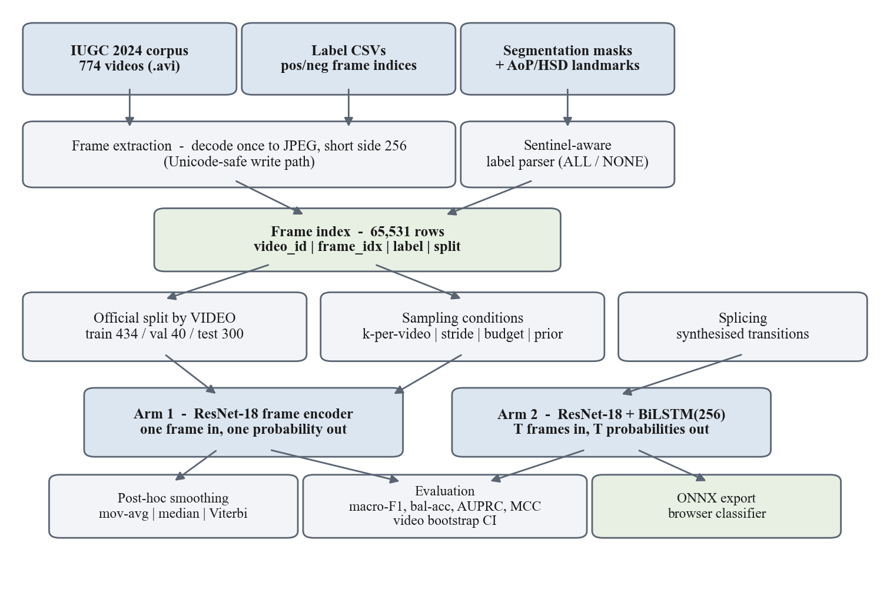

# Intrapartum Standard-Plane Classification

[](https://github.com/AkhilTeja2209/intrapartum-plane-density/actions/workflows/ci.yml)
[](https://github.com/AkhilTeja2209/intrapartum-plane-density/actions/workflows/pages.yml)
[](https://www.python.org/)
[](LICENSE)

A deep learning pipeline that classifies intrapartum transperineal ultrasound
frames as **standard** or **non-standard** — that is, whether the pubic
symphysis and fetal head are resolved well enough to measure the angle of
progression.

It also runs a controlled study of **frame sampling density**: both the sparse
("image dataset") and dense ("video dataset") arms are built from one corpus by
varying only how many frames are drawn per video, with budget-matched and
prior-matched arms to separate density from sample count.

**Live demo:** [akhilteja2209.github.io/intrapartum-plane-density](https://akhilteja2209.github.io/intrapartum-plane-density/)
— drop in a frame, inference runs in your browser. Research demo, not a medical device.

---

## Installation

```bash
git clone https://github.com/AkhilTeja2209/intrapartum-plane-density.git
cd intrapartum-plane-density
pip install -r requirements.txt
```

### Dataset

The IUGC 2024 corpus (774 videos, CC-BY-4.0) is not redistributed here.
Download `DatasetV3.zip` from
[Zenodo 10.5281/zenodo.17655183](https://zenodo.org/records/17655183) into
`data/`, then unwrap its nested archives:

```bash
python tools/unpack_dataset.py --zip data/DatasetV3.zip --out data/DatasetV3
```

---

## Quick start

Verify the whole pipeline on synthetic data first — no dataset, no GPU, ~2 minutes:

```bash
python -m src.smoke_test --synthetic
```

Then prepare the real data and train:

```bash
# 1. decode videos to pre-resized frames
python -m src.extract_frames --dataset-root data/DatasetV3 --out-dir data/frames

# 2. join frames to labels (refuses to write unless the join rate is 1.0)
python -m src.build_index --dataset-root data/DatasetV3 --frames-dir data/frames --out data/index.csv

# 3. split by video using the dataset's official folders
python -m src.splits --index data/index.csv --out data/splits.json --scheme official

# 4. compute the matched-budget frame counts and write them into the config
python -m src.make_budgets --config configs/default.yaml --write

# 5. train one condition
python -m src.run_experiment --condition dense_all --model frame --seed 0
```

---

## Commands

### Pipeline

| Command | Description |
|---|---|
| `src.extract_frames` | Decode each video once to pre-resized JPEG frames |
| `src.build_index` | Build the frame-level index; enforces label-join invariants |
| `src.splits` | Video-level split (`--scheme official` or `regrouped`) |
| `src.make_budgets` | Compute Protocol B frame budgets from the split |
| `src.run_experiment` | Train and evaluate one condition × one seed |
| `src.analyze` | Summary tables, density curve, paired bootstrap tests |
| `src.gradcam` | Fraction of Grad-CAM mass falling inside anatomy masks |
| `src.smoke_test` | End-to-end synthetic run of every stage |

### Tooling

| Command | Description |
|---|---|
| `tools/unpack_dataset.py` | Unwrap the nested Zenodo archives |
| `tools/run_grid.py` | Run a condition grid, cheapest-first, resumable |
| `tools/seed_summary.py` | Aggregate repeated seeds; per-seed paired deltas |
| `tools/export_onnx.py` | Export a checkpoint for the browser demo, with verification |
| `tools/make_site_summary.py` | Collect results into the demo's summary JSON |
| `tools/make_architecture_figure.py` | Regenerate `docs/architecture.png` |

### Common options

```bash
# temporal arm instead of frame-wise
python -m src.run_experiment --condition dense_all --model temporal --seed 0

# a whole grid across seeds
python tools/run_grid.py --plan arm1 --seeds 0
python tools/run_grid.py --plan headline --seeds 1,2

# ablation: disable transition splicing
python -m src.run_experiment --config configs/no_splice.yaml \
    --condition dense_all --model temporal --seed 0 --tag nosplice
```

---

## Architecture



Videos, label files and segmentation annotations enter at the top. Frames are
decoded once rather than per epoch, and a sentinel-aware parser reads the label
files. The two streams meet at a **single frame-level index** that every
downstream stage reads, so no condition can accidentally derive different
labels from another. The split is fixed once at video level and reused by every
condition. Both arms share one encoder definition and differ only in the head,
so both emit one probability per frame and the same metrics apply to each.

| Module | Role |
|---|---|
| `src/extract_frames.py` | Video → JPEG frames, Unicode-safe write path |
| `src/build_index.py` | Label parsing and the frame index; integrity assertions |
| `src/splits.py` | Video-level splits, leakage assertions, transition diagnostics |
| `src/sampling.py` | The study's independent variable: k, stride, budget, prior |
| `src/datasets.py` | Frame and clip views, augmentation, transition splicing |
| `src/models.py` | One shared ResNet-18 encoder; frame-wise and BiLSTM heads |
| `src/engine.py` | One trainer for both arms |
| `src/metrics.py` | Imbalance-aware and video-level metrics, video bootstrap |
| `src/smoothing.py` | Post-hoc smoothing — the baseline the temporal arm must beat |
| `src/analyze.py` | Summary tables and significance tests |
| `site/` | Static browser demo running the exported model client-side |

---

## Experimental conditions

Defined in `configs/default.yaml`. Sampling applies to the training split only;
every condition is scored on the identical complete test set.

| Group | Conditions | What it varies |
|---|---|---|
| Sparse | `sparse_k1`, `k2`, `k5`, `k10`, `k20` | k frames per video |
| Dense | `dense_stride8`, `stride4`, `stride2`, `dense_all` | temporal stride |
| Budget-matched | `dense_matched_k5`, `dense_matched_k20` | dense arm capped to the sparse arm's frame count |
| Prior-matched | `dense_prior_matched_k5`, `dense_prior_matched_k20` | frame count **and** class prior held fixed |

---

## Results

ResNet-18 on the official split, scored on the same 8,665-frame test set.

| Condition | Train frames | macro-F1 (3 seeds) |
|---|---:|---|
| `sparse_k1` | 434 | 0.682 ± 0.053 |
| `sparse_k5` | 2,170 | 0.638 ± 0.050 |
| `dense_matched_k5` | 2,170 | 0.576 ± 0.034 |
| `dense_prior_matched_k5` | 2,170 | 0.608 ± 0.119 |
| `dense_all` | 53,996 | 0.610 ± 0.032 |

More frames did not help — the strongest single result came from 434 training
frames, one per video. The budget-matched comparison **reverses sign across
seeds** (−0.106, +0.013, −0.093), and one condition moves 0.231 macro-F1 on
identical data, so seed-to-seed variance exceeds any density effect at this
corpus size.

Temporal arm on `dense_all`: frame-wise 0.579 raw and 0.545 smoothed, against
0.670 for the BiLSTM with spliced transitions. The ablation without splicing
reaches 0.650, so the temporal gain is not attributable to transition modelling.

---

## Requirements

- Python 3.10 or later
- PyTorch 2.0+ with CUDA for training (CPU is fine for the synthetic smoke test)
- ~10 GB disk for the dataset and extracted frames
- A CUDA GPU with 8 GB VRAM reproduces the full grid in roughly 5 GPU-hours

Dependencies are listed in `requirements.txt`.

---

## License

Code is MIT-licensed — see [LICENSE](LICENSE).

The IUGC 2024 dataset is distributed separately by its authors under CC-BY-4.0
and is not redistributed in this repository.
